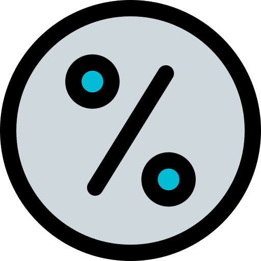

# modulo+

A Creative Extension to the [```modulo```](https://github.com/francesco-di-maggio/modulo) Package. 

## About 

Extend your musical creativity with interactive machine learning algorithms, mapping modules, ready-to-use instruments and interfaces.

## Installation

If you have [Git](http://git-scm.com/) or [GitHub Desktop](https://desktop.github.com/) installed, you can clone this repo via Terminal using the following commands:

	cd ~/Documents/Max\ 8/Packages
	git clone https://github.com/francesco-di-maggio/modulo-plus

Alternatively, you can download the latest release [here](https://github.com/francesco-di-maggio/modulo-plus). After decompressing the zip archive, place the resulting folder in the Max search path, preferably in ```Max > Packages```:

* `~/Documents/Max\ 8/Packages`

## Get Started

Open the Overview Patch (modulo-plus-main/extras/modulo-plus.maxpat).

## Externals

Some modules requires external libraries that need to be installed and placed in the Max search path:

* [CNMAT-Externs](https://github.com/CNMAT/CNMAT-Externs)
* [Fluid Corpus Manipulation](https://www.flucoma.org/download)
* [Mubu for Max](https://forum.ircam.fr/projects/detail/mubu/)
* [myo-for-max](https://github.com/JulesFrancoise/myo-for-max)